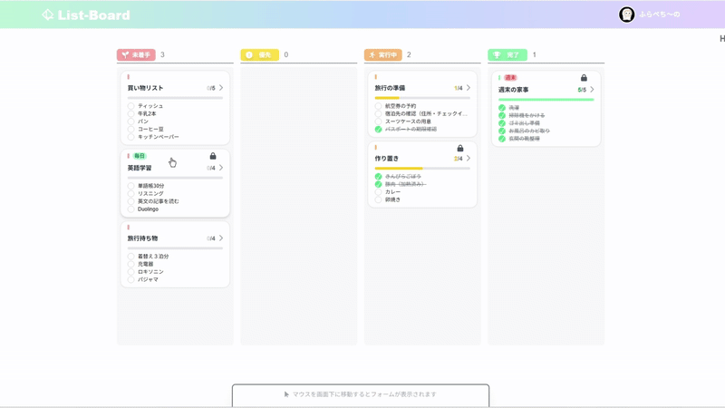

# List-Board

[](https://nextjs.org) [](https://reactjs.org) [](https://tailwindcss.com) [](https://firebase.google.com) [](https://vercel.com)

## 概要

このアプリは、日々のタスクを効率的に管理できるタスク管理アプリです。
就職活動用のポートフォリオとして、React・Next.js・Firebase を用いて開発しました。

## 特徴

- Firebase Authentication によるユーザー認証
- Firestore でのデータ保存
- タスクとリストのドラッグ＆ドロップによる並び替え
- リストをテキストでコピーし、メールや LINE 等で共有
- スマホ・PC 対応のレスポンシブデザイン
- 匿名ユーザーでの使用も可能（ログインしなくても利用可）
- 未ログイン,ゲストログイン,ログインの３モード

## 技術スタック

- **フロントエンド**：Next.js (App Router), React
- **スタイリング**：Tailwind CSS
- **バックエンド**：Firebase（Authentication / Firestore）
- **デプロイ**：Vercel

## デモサイト

🔗 [List-Borad](https://portfolio-1-todo-6f2i.vercel.app/)

## 画面イメージ

### PC 操作画面

  



### スマホ操作画面

<p>
  
  
</p>
<p>
  
  
</p>
<p>
  
</p>

## 機能一覧

- ユーザー登録・ログイン（メールアドレス / 匿名ログイン）
- ゲスト利用モード（ログイン不要）
- 入力フォームの展開
- 詳細ページのモーダル表示
- タスクの追加・編集・削除
- チェックボックスでの進捗管理
- タスクリストの並び替え（ドラッグ＆ドロップ）
- リストのロック機能で誤削除を防止
- 希望の曜日にタスクの進捗をリセットする機能
- テキスト形式でリストをコピー
- ローカルデータの反映（Firestore）
- アカウント名、アイコンの編集

## 使用方法（ローカル実行）

```bash
git clone https://github.com/Planet0227/portfolio-1-todo
cd nextjs-todo
npm install
npm run dev
```

## 使い方

- アプリの起動後は未ログイン状態です。この状態で作成したリストは firebase に保存されず、リロードなどで消えてしまいます。
- 画面上部からゲストログインかログイン/新規登録のボタンからログインや登録が出来ます。
- ゲストログイン状態では作成したデータが保存されます。ログアウトをするとアカウントごとデータが削除されます。
- ゲストログイン中に新規登録するとゲスト状態で作成したデータが新規アカウントに引き継がれます。
- ログイン状態ではリストデータの保存に加え、アカウント名やアイコンを編集出来ます。また、同じアカウントでログインすることで、別のデバイスでも使用できます。
---

## 要件定義

### 1. システム概要

日々のタスクを効率的に管理できる Web アプリケーション。Next.js（App Router）＋ React／Tailwind CSS でフロントを構築し、Firebase Authentication／Firestore をバックエンドに採用。匿名ユーザー・メールアドレス認証の切り替えに対応し、データはリアルタイムに反映・同期される。


### 2. 利用者

- **未ログインユーザー（Anonymous）**

  - 画面上部からゲスト利用モードに切り替え可能。
  - リスト・タスクの作成・編集・並び替え・削除ができるが、Firebase には保存されずブラウザリロードで消去される。

- **ゲストログインユーザー**

  - 匿名認証を行い、一時的に Firestore へデータを保存。
  - ログアウト時に全データが削除される。
  - 後日メール認証登録すると、データを新規アカウントへ引き継ぎ可能。

- **認証済みユーザー（メールアドレス＆パスワード）**
  - 永続的に Firestore へデータを保存。
  - アカウント名・アイコンを編集可能。
  - 複数デバイス間で同一アカウントを利用可能。

### 3. 機能要件

| No. | 機能カテゴリ     | 機能詳細                                                                               | 実装状況 |
| --- | ---------------- | -------------------------------------------------------------------------------------- | :---: |
| F1  | ユーザー認証     | - Firebase Authentication を使用し、メールアドレス／パスワードまたは匿名ログインを提供する。<br>- 匿名ログインは Firestore に一時保存、ログアウトで削除される。 | 済 |
| F2  | リスト管理       | - リストの追加・編集はレイアウト崩れを考慮して14文字制限<br>- リストの削除<br>- リストのロック／アンロック             | 済 |
| F3  | タスク管理       | - タスクの追加・編集（内容）・削除<br>- チェックボックスでの進捗管理             | 済 |
| F4  | 並び替え         | - @dnd-kit/sortable を用いてリストをドラッグ＆ドロップ可能。<br>- 各リスト内タスクのドラッグ＆ドロップ並び替え<br>- 別のリストにドラッグで追加は不可   | 済 |
| F5  | リセット機能     | - 各リストに対して、曜日ごとに進捗リセットの有無を設定できる。<br>- 週1〜7日の頻度で自動チェック解除。<br>- `checkAndResetTasks` 関数により、アプリ起動時またはリロード時に `localStorage` の `lastResetDate` を確認し、当日リセット未実行かつ `resetDays` マップで当日のリセットが有効なリストの全タスクを `updateDoc` で `complete: false` に更新。Firestore とローカルステートを同期                 | 済 |
| F6  | リマインダー機能 | -`scheduledDate` フィールドを使用し、リストの期限日や数日前に通知する機能。<br>- リマインダー通知機能は今後実装予定。メール or PWA 通知を検討中。   | 未実装 |
| F7  | 共有機能       | - リストをテキスト形式でクリップボードにコピー<br>- LINE／メール等への貼り付け用<br>- コピー成功時はトーストを表示       | 済 |
| F8  | モーダル表示     | - タスク詳細ページをモーダルで表示。<br>- 将来的にuseRouter等でページ遷移を伴わないURLの変更でリストにアクセスし、リスト単位で共有できるように変更予定。                                                     | 一部済 |
| F9  | リアルタイム同期 | - onSnapshotを使って双方向同期。複数のユーザーで編集可能に。                                                 | 未実装 |
| F10  | データ同期 | - Firestoreからデータを取得しローカルに反映。変更は都度Firestoreに保存                 | 済 |
| F11  | アカウント設定   | - 表示名・アイコンのアップロード／更新                                                 | 済 |


### 4. 非機能要件

- **レスポンスタイム**：ドラッグ＆ドロップ操作は遅延なく反応
- **対応ブラウザ**：最新の Chrome／Firefox／Safari／Edge
- **レスポンシブ対応**：スマホ（縦横）／タブレット／PC
- **セキュリティ**：
  - Firebase Authentication で認証情報を保護
  - Firestore セキュリティルールで読み書き権限を制御
- **可用性**：Vercel ＋ Firebase の組み合わせで常時稼働を確保
- **拡張性**：機能追加が容易なコンポーネント設計


### 5. 技術要件

#### 5-1 開発言語等
- **フロントエンド**：Next.js (App Router), React
- **スタイリング**：Tailwind CSS
- **バックエンド**：Firebase（Authentication / Firestore）
- **デプロイ**：Vercel

#### 5-2 Firestore コレクション構造

■ User 情報（ユーザーアカウント）
パス：`users/{uid}/accountInfo/default`
| フィールド名 | 型 | 説明 | 実装状況 |
| ----------- | ------ | --------------- | :---: |
| displayName | string | ユーザーの表示名 | 済 |
| iconDataUrl | string | Base64 形式のアイコン画像 | 済 |

■ List（リスト）
パス：`users/{uid}/lists/{listId}`
| フィールド名 | 型 | 説明 | 実装状況 |
| -------- | ------- | ------------------------ | :---: |
| category | string | 所属カテゴリー | 済 |
| date | string | リストの作成日 | 済 |
| scheduledDate | string | リストの期限。リマインダー等で使用。 | 未実装 |
| locked | boolean | リストのロック状態（true で削除不可） | 済 |
| order | number | 並び順の保持| 済 |
| resetDay | Map<string, boolean> | 各曜日に対してタスクの進捗を自動リセットするかどうかを指定（例：{ mon: true, tue: false, ... } | 済 |
| title | string | リストのタイトル | 済 |

■ Task（タスク）
パス：`users/{uid}/lists/{listId}/tasks/{taskId}`
| フィールド名 | 型 | 説明 | 実装状況 |
| ------- | ------- | ---------- | :---: |
| content | string | タスクの内容 | 済 |
| complete | boolean | チェック済みかどうか | 済 |
| order | number | タスクの並び順 | 済 |
| url | string | 商品ページ等のURL | 未実装 |

