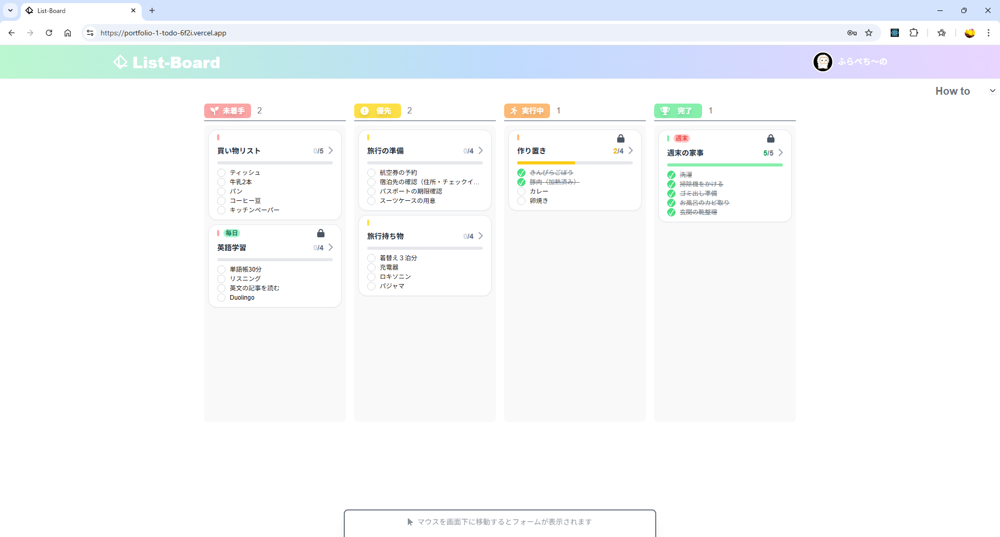
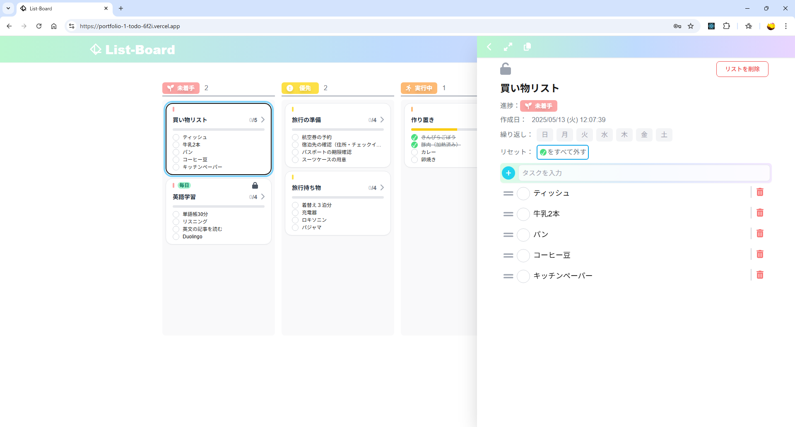
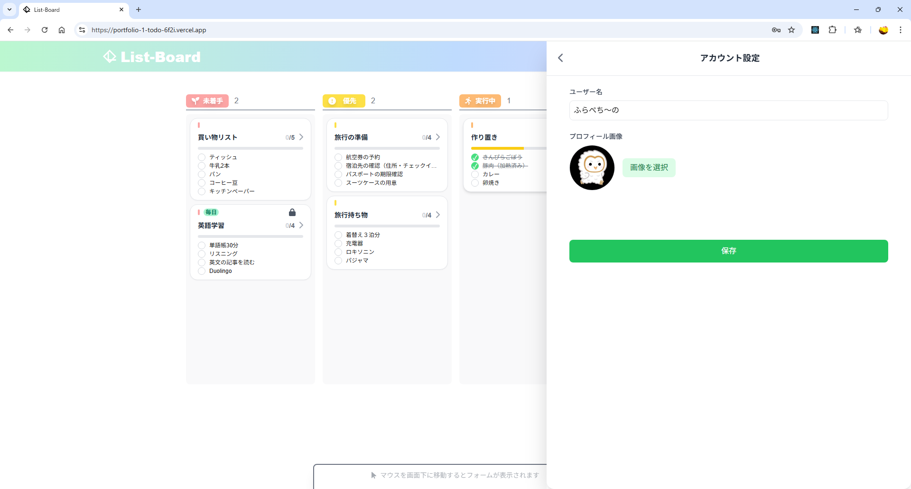
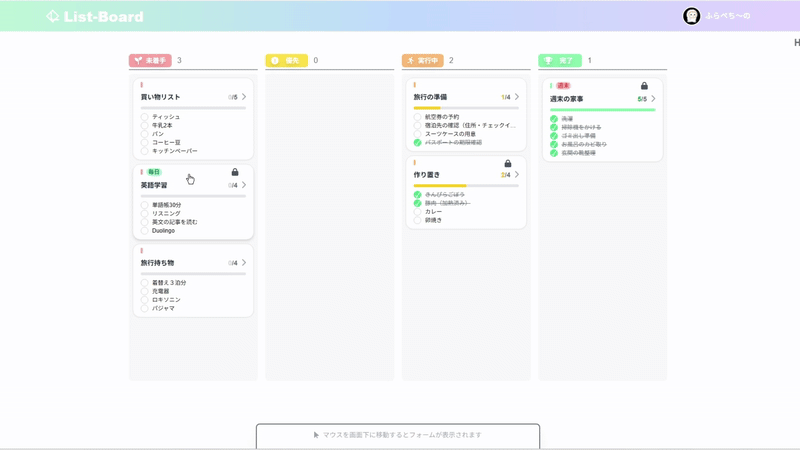
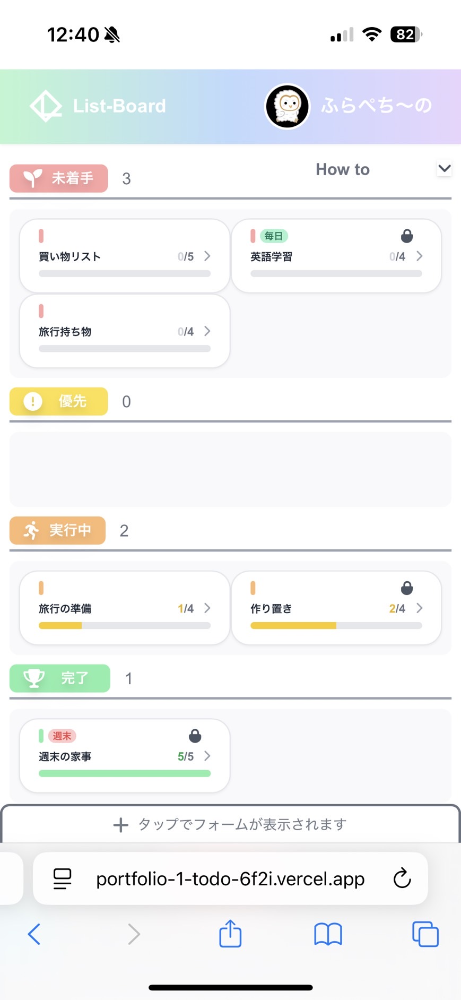
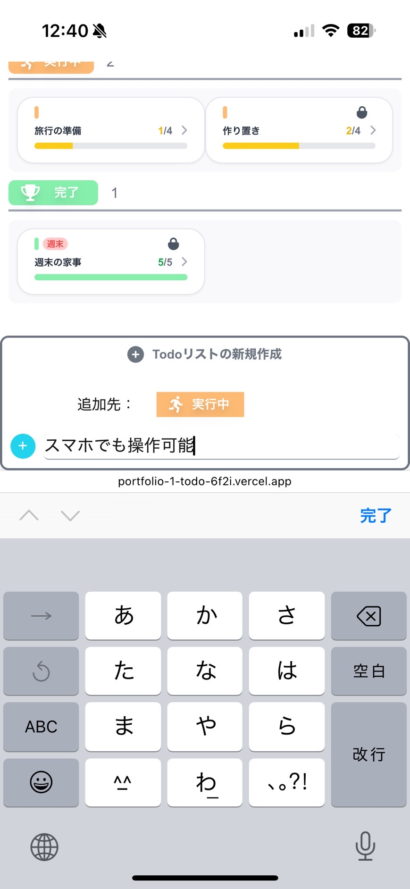
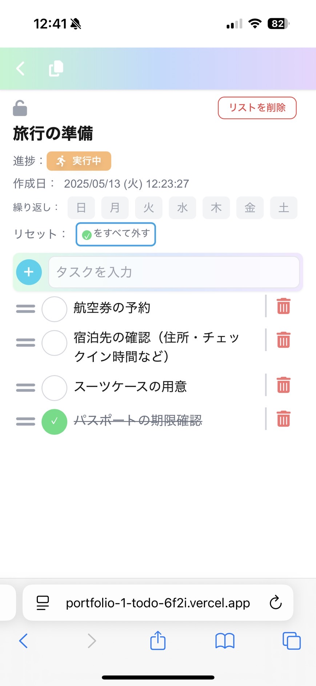
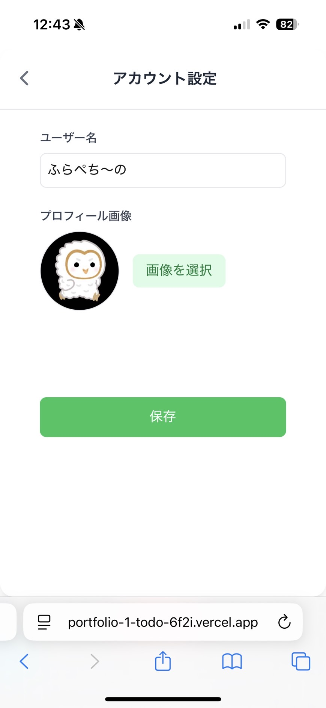

# List-Board

[](https://nextjs.org) [](https://reactjs.org) [](https://tailwindcss.com) [](https://firebase.google.com) [](https://vercel.com)

## 概要

このアプリは、日々のタスクを効率的に管理できるタスク管理アプリです。
就職活動用のポートフォリオとして、React・Next.js・Firebase を用いて開発しました。

## 特徴

* Firebase Authentication によるユーザー認証
* Firestore でのデータ保存
* タスクとリストのドラッグ＆ドロップによる並び替え
* リストをテキストでコピーし、メールやLINE等で共有
* スマホ・PC対応のレスポンシブデザイン
* 匿名ユーザーでの使用も可能（ログインしなくても利用可）
* 未ログイン,ゲストログイン,ログインの３モード

## 技術スタック

* **フロントエンド**：Next.js (App Router), React
* **スタイリング**：Tailwind CSS
* **バックエンド**：Firebase（Authentication / Firestore）
* **デプロイ**：Vercel

## デモサイト

🔗 [List-Borad](https://portfolio-1-todo-6f2i.vercel.app/)

## 画面イメージ

### PC 操作画面

  



### スマホ操作画面

   


## 機能一覧

* ユーザー登録・ログイン（メールアドレス / 匿名ログイン）
* ゲスト利用モード（ログイン不要）
* 入力フォームの展開
* 詳細ページのモーダル表示
* タスクの追加・編集・削除
* チェックボックスでの進捗管理
* タスクリストの並び替え（ドラッグ＆ドロップ）
* リストのロック機能で誤削除を防止
* 希望の曜日にタスクの進捗をリセットする機能
* テキスト形式でリストをコピー
* リアルタイムでのデータ反映（Firestore）
* アカウント名,アイコンの編集

## 使用方法（ローカル実行）

```bash
git clone https://github.com/Planet0227/portfolio-1-todo
cd nextjs-todo
npm install
npm run dev
```

## 使い方

* アプリの起動後は未ログイン状態です。この状態で作成したリストはfirebaseに保存されず、リロードなどで消えてしまいます。
* 画面上部からゲストログインかログイン/新規登録のボタンからログインや登録が出来ます。
* ゲストログイン状態では作成したデータが保存されます。ログアウトをするとアカウントごとデータが削除されます。
* ゲストログイン中に新規登録するとゲスト状態で作成したデータが新規アカウントに引き継がれます。
* ログイン状態ではリストデータの保存に加え、アカウント名やアイコンを編集出来ます。また、同じアカウントでログインすることで、別のデバイスでも使用できます。

